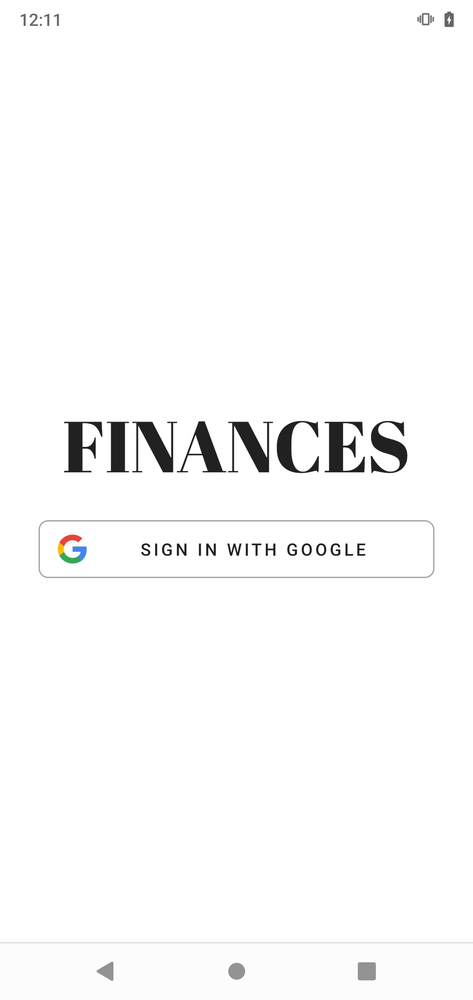
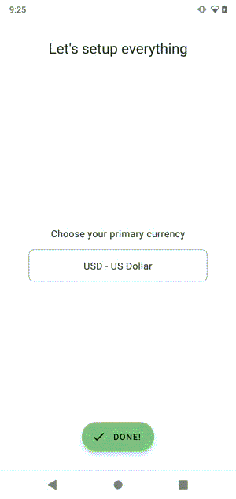
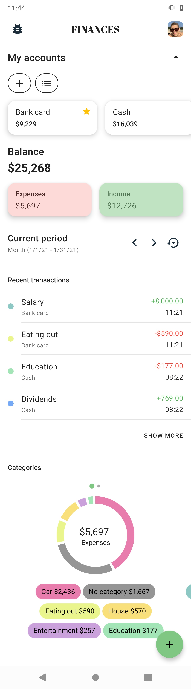
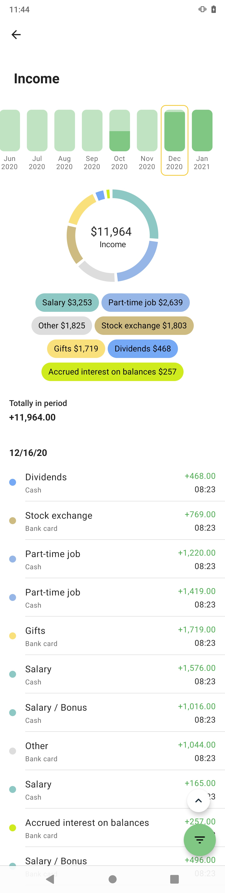
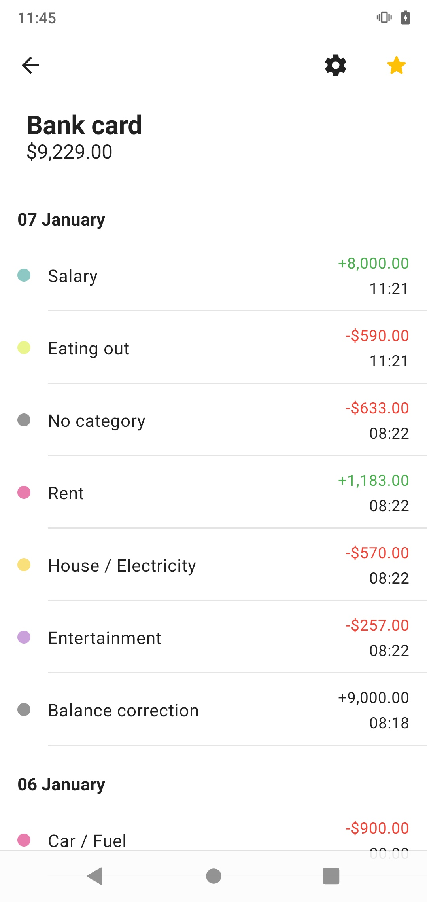
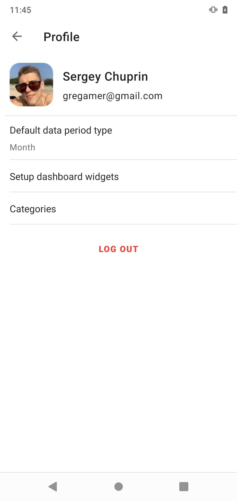
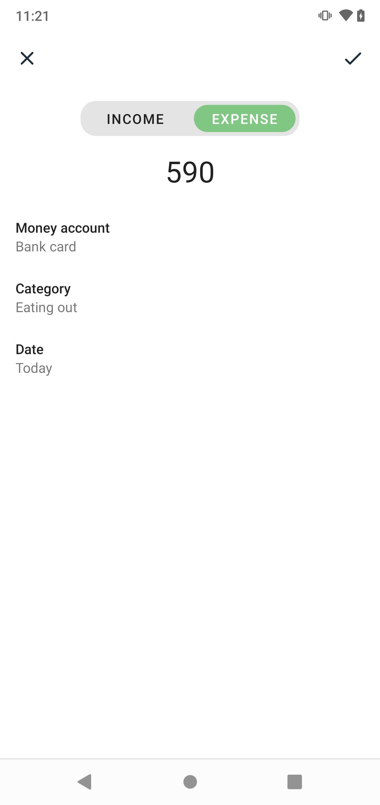
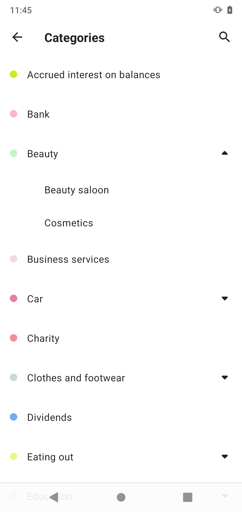

Finotracks - finance control app as technology playground (WIP 🛠️)
Created and maintained by Aswinpbsa

APKs are hosted on AppCenter

Tech stack:
Kotlin for all code

GitHub Actions for CI and CD

Kotlin serialization for parsing JSONs

Gradle Kotlin DSL for build scripts configuration

Multi module architecture for faster builds and code separation

Clean architecture for architecture

Coroutines and Kotlin Flow for async work

Java 8 desugaring for working with date, time and optional

Dagger 2 for DI

MVI for presentation layer

Firebase (Authentication, Firestore) for storing data

Jetpack (Navigation, ViewModel, LiveData, Lifecycle) for
presentation layer

Material Components for styling UI components and transitions

Motion layout for animating some layouts

Coil for images loading

Beagle for debug menu

Strikt for building assertions in tests

Spek for unit tests

MockK for mocks

Some other tools:
Gradle Modules Graph visualizer

Proguard & R8 Dictionaries Generator - for generating randomized dictionaries for Proguard (and R8)

Interesting stuff:
Dashboard building

Transactions report building

Working with data periods

MVI implementation

Pie chart

Modules configuration

Screens
Screen	Remarks	How it looks
Authorization		
Onboarding		
Dashboard		
Report	Filter button is not working,
clicking on category shares does nothing	
Money account		
User		
Transaction	Editing balance transaction isn't supported yet	
Categories		

Some other screens not listed above

What's not working:
No multi-currency support (all amounts are calculated in default user's currency)

Filter button on transactions report screen is not working

Clicking on category on transactions report screen is not working

Editing balance transaction is not supported yet
